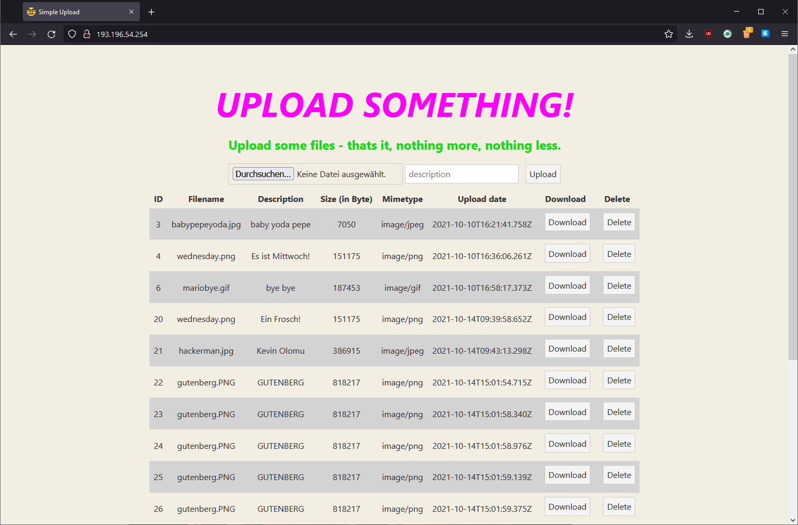

# Simple Upload

This is just a simple demo application for the "Cloud Application Development" lesson. No design, no overengineering - just a simple application to provide some learning use cases.

## Additional Information

### Operating System

The Application should be able to run on any operating system, that is able to install [Node.js](https://nodejs.org/en/) with the package manager "npm".

### Programming Language

The used programming language in the application is Javascript (ECMA2015). 

Also there is some HTML and CSS, which are not realy programming languages, but should also be noted.

### Webframework

The application is split into a frontend and a backend. They communicate over a REST API that the backend provides.

The frontend is build on [Svelte](https://svelte.dev), which is a fast modern web framework. Which compiles its components to pure javascript code instead of relying on a virtual dom. That brings a high efficiency at runtime.

The backend is build with [Express](https://expressjs.com/de/), which is a minimal and flexible [Node.js](https://nodejs.org/en/) web application framework that provides a whole set of features to develop serverside web applications.

### Runtime Environment

[Node.js](https://nodejs.org/en/) is the main runtime environment for the application.

### Database

To persists the uploaded data, [SQLite3](https://www.sqlite.org/index.html) is used. It's a small, fast, self-contained SQL database engine, that doesn't require an additional database server.

For an easy interaction between the backend and the database the OR-Mapper [Prisma](https://www.prisma.io/) is used. It helps by abstracting the database, so you're able to interact with representative models of the tables instead of sending raw queries to alter the database.

## Running the App

1. Build and run the frontend `cd frontend && npm i && npm run build && npm start`
2. Build and run the backend `cd backend && npm i && node index.js`
3. Visit `http://localhost:5000`

## Recommendations

### Hosting the App

For hosting the application on a Server, you can install NGINX and use the provided configuration file. It simply redirects all incoming requests on port 80 based on the requested location. 
If the requests goes for `/` it's redirected to `http://localhost:5000` (Frontend) and if it goes for `/api/*` it is redirected to `http://localhost:8080` (Backend).

### Conveniently running the App

To run the frontend and backend in the background, you can use [PM2](https://www.npmjs.com/package/pm2). 

1. Run frontend in background `cd frontend && pm2 start npm -- start`
2. Run backend in background `cd backend && pm2 start node index.js`

You can also use the [Startup](https://pm2.keymetrics.io/docs/usage/startup/) feature of PM2 to restart the processes with the server start.

1. Generate a PM2 startup script `pm2 startup` (Execute the appearing command on your terminal)
2. If you have your apps started (see above) execute `pm2 save` to bind these apps to the startup script
